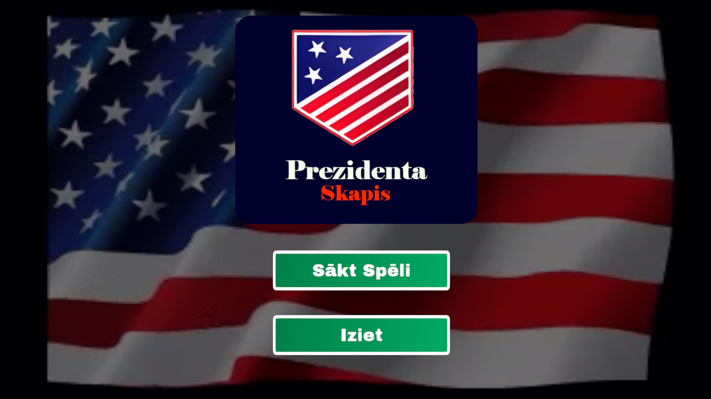
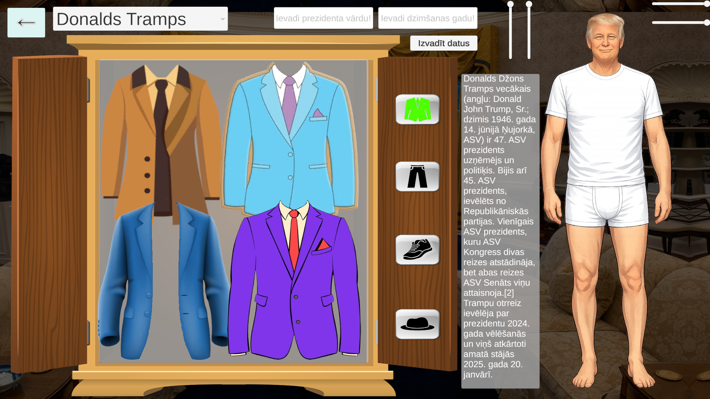
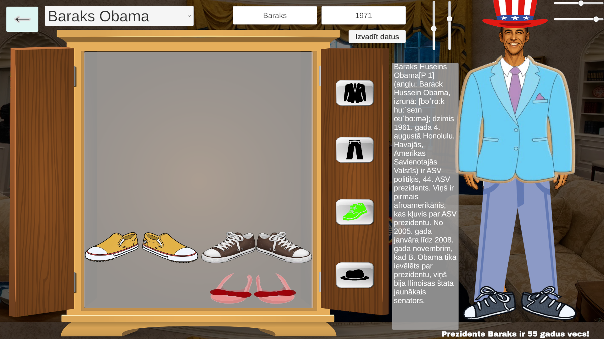
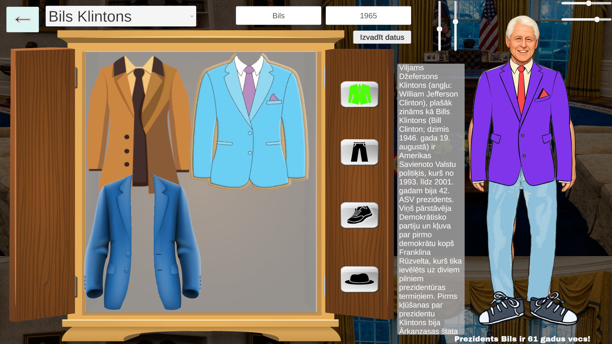

# Projekts: Prezidentu Skapis 🚪

Unity UI darbs, kas ļauj lietotājam aptērpt ASV prezidentus.

## Apraksts
Šis ir interaktīvs 2D projekts, kurā lietotājs var personalizēt prezidentu ar dažādiem apģerba gabaliem. Spēle ietver tēlu atlasi, informācijas ievadi, dinamisku apģērbu skapi ar drag-and-drop funkcionalitāti un tēla proporciju mainīšanu.

## Realizētās prasības

### 1. Informācijas ievade un apstrāde
**Vārda un vecuma ievade:** Izmantoti `Input Field` komponenti.

### 2. Tēlu atlase
* **Dropdown izvēlne:** Ļauj pārslēgties starp 3 unikāliem tēliem.
* **Scroll View:** Katram tēlam ir savs apraksta teksts.

### 3. Drēbju Skapis
**Toggle Pogas:** Apģērbi sakārtoti kategorijās (Uzvalki, Bikses, Apavi, Cepures).

### 4. Drag and Drop sistēma
* **Kategorizēšana:** Katrā kategorijā tēlam var būt tikai viens uzvilkts priekšmets. Uzvelkot jaunu, vecais automātiski atgriežas skapī.
* **SFX:** Skaņas efekti, kad lietotājs velk un noliek apģērbu.

### 5. Transformāciju Slideri
* **Tēla mērogs:** Divi slaideri kontrolē tēla augstumu un platumu.
* **Drēbju mērogs:** Divi slaideri kontrolē uzvilkto drēbju izmēru, izmantojot reizinātāja sistēmu, lai saglabātu katra priekšmeta oriģinālās proporcijas.

---

## Izstrādes ekrānuzņēmumi

---
## Kā palaist?
1. Lejupielādējiet arhivēto failu no Build sadaļas.
2. Atarhivējiet mapi ar WinRAR vai 7-Zip
3. Palaidiet `.exe` failu.

